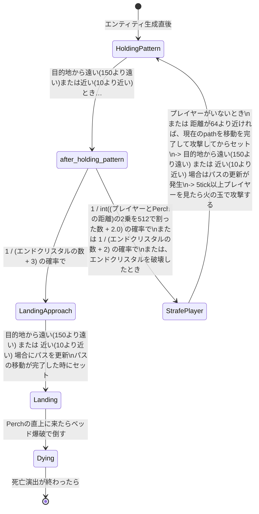
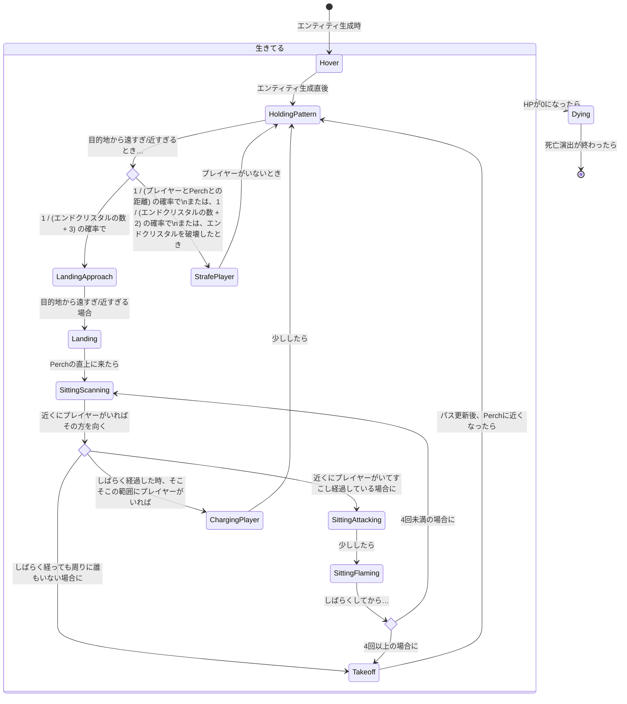

# 調査結果

## For RTA Players



## Normal



## Detailed

````mermaid
stateDiagram-v2
    [*] --> Hover : エンティティ生成時に PhaseManager でセット
    state 生きてる {
        state after_holding_pattern <<choice>>
        state after_sitting_scanning <<choice>>
        state after_sitting_flaming <<choice>>
        Hover --> HoldingPattern : エンティティ生成直後の処理内部の EnderDragonEntity#createDragon() でセット
        HoldingPattern --> after_holding_pattern : 目的地から遠い(150より遠い)または近い(10より近い)とき…
        after_holding_pattern --> LandingApproach : 1 / (エンドクリスタルの数 + 3) の確率でセット
        after_holding_pattern --> StrafePlayer : 1 / int((プレイヤーとerchの距離)の2乗を512で割った数 + 2.0) の確率で\nまたは 1 / (エンドクリスタルの数 + 2) の確率で\nまたは、エンドクリスタルを破壊したとき
        StrafePlayer --> HoldingPattern : 距離が64より近ければ、現在のpathを移動を完了してから攻撃して、終了後にセット\n-> 目的地から遠い(150より遠い) または 近い(10より近い) 場合はパスの更新が発生\n-> 5tick以上プレイヤーを見たら火の玉で攻撃する\n\nまたはプレイヤーがいなければセット
        LandingApproach --> Landing : 目的地から遠い(150より遠い) または 近い(10より近い) 場合にパスを更新、パスの移動が完了した時にセット
        Landing --> SittingScanning : ターゲット(Perch)までの距離が1未満の時にセット
        SittingScanning --> after_sitting_scanning : 距離20までにプレイヤーがいれば一番近いプレイヤーの方を向く
        after_sitting_scanning --> SittingAttacking : 距離20までにプレイヤーがいて25tick以上経過している場合にセット
        after_sitting_scanning --> Takeoff : 100tick経過後、誰もいない場合にセット
        after_sitting_scanning --> ChargingPlayer : 100tick経過後、距離20より離れてて距離150までにプレイヤーがいればセット そのままプレイヤーに向かってくる
        SittingAttacking --> SittingFlaming : 40tick経過後にセット
        SittingFlaming --> after_sitting_flaming : 200tick経過後…
        after_sitting_flaming --> SittingScanning : 連続回数が4回未満の場合にセット
        after_sitting_flaming --> Takeoff : 連続回数が4回以上の場合にセット
        Takeoff --> HoldingPattern : パスを更新して移動、Perchから距離10以内になったらセット
        ChargingPlayer --> HoldingPattern : 最長10tickの間、プレイヤーに突っ込んでくる\nプレイヤーから遠い(150より遠い) または 近い(10より近い)場合はtickが短くなる
    }
    生きてる --> Dying : HPが0になった時にセット (内部的にはDYING中はHPが1になる)
    Dying --> [*] : Perchから10より近い または 150より遠い時にセット\n(HPも0になってエンティティが消滅する)```
````
