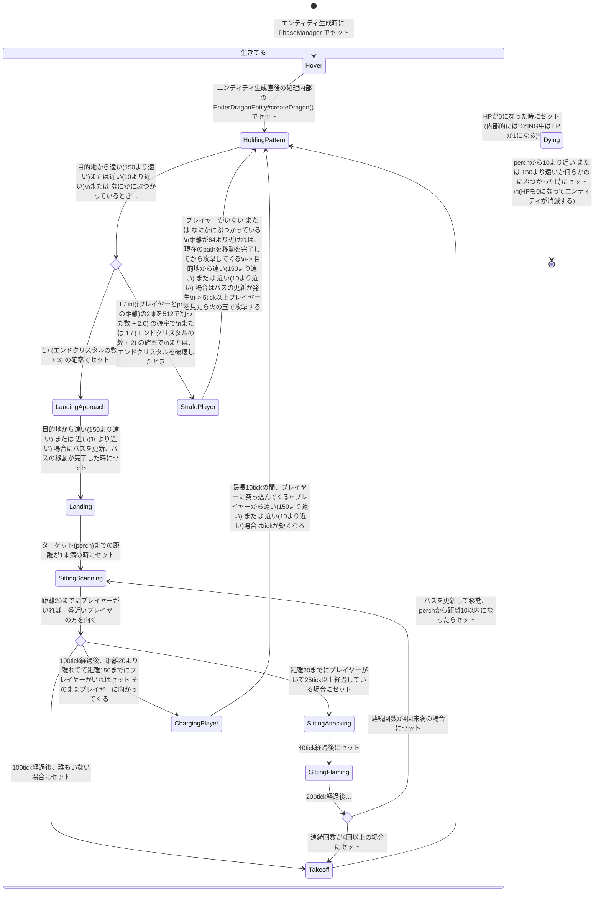
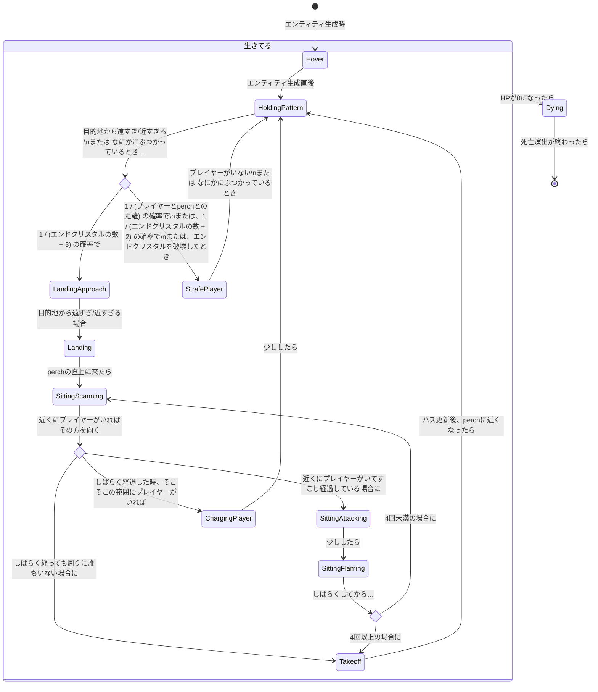

# 調査結果

```mermaid
stateDiagram-v2
    [*] --> Hover : エンティティ生成時に PhaseManager でセット
    state 生きてる {
        state after_holding_pattern <<choice>>
        state after_sitting_scanning <<choice>>
        state after_sitting_flaming <<choice>>
        Hover --> HoldingPattern : エンティティ生成直後の処理内部の EnderDragonEntity#createDragon() でセット
        HoldingPattern --> after_holding_pattern : 目的地から遠い(150より遠い)または近い(10より近い)\nまたは なにかにぶつかっているとき…
        after_holding_pattern --> LandingApproach : 1 / (エンドクリスタルの数 + 3) の確率でセット
        after_holding_pattern --> StrafePlayer : 1 / int((プレイヤーとperchの距離)の2乗を512で割った数 + 2.0) の確率で\nまたは 1 / (エンドクリスタルの数 + 2) の確率で\nまたは、エンドクリスタルを破壊したとき
        StrafePlayer --> HoldingPattern : プレイヤーがいない または なにかにぶつかっている\n距離が64より近ければ、現在のpathを移動を完了してから攻撃してくる\n-> 目的地から遠い(150より遠い) または 近い(10より近い) 場合はパスの更新が発生\n-> 5tick以上プレイヤーを見たら火の玉で攻撃する
        LandingApproach --> Landing : 目的地から遠い(150より遠い) または 近い(10より近い) 場合にパスを更新、パスの移動が完了した時にセット
        Landing --> SittingScanning : ターゲット(perch)までの距離が1未満の時にセット
        SittingScanning --> after_sitting_scanning : 距離20までにプレイヤーがいれば一番近いプレイヤーの方を向く
        after_sitting_scanning --> SittingAttacking : 距離20までにプレイヤーがいて25tick以上経過している場合にセット
        after_sitting_scanning --> Takeoff : 100tick経過後、誰もいない場合にセット
        after_sitting_scanning --> ChargingPlayer : 100tick経過後、距離20より離れてて距離150までにプレイヤーがいればセット そのままプレイヤーに向かってくる
        SittingAttacking --> SittingFlaming : 40tick経過後にセット
        SittingFlaming --> after_sitting_flaming : 200tick経過後…
        after_sitting_flaming --> SittingScanning : 連続回数が4回未満の場合にセット
        after_sitting_flaming --> Takeoff : 連続回数が4回以上の場合にセット
        Takeoff --> HoldingPattern : パスを更新して移動、perchから距離10以内になったらセット
        ChargingPlayer --> HoldingPattern : 最長10tickの間、プレイヤーに突っ込んでくる\nプレイヤーから遠い(150より遠い) または 近い(10より近い)場合はtickが短くなる
    }
    生きてる --> Dying : HPが0になった時にセット (内部的にはDYING中はHPが1になる)
    Dying --> [*] : perchから10より近い または 150より遠いか何らかのにぶつかった時にセット\n(HPも0になってエンティティが消滅する)
```

```mermaid
stateDiagram-v2
    [*] --> Hover : エンティティ生成時
    state 生きてる {
        state after_holding_pattern <<choice>>
        state after_sitting_scanning <<choice>>
        state after_sitting_flaming <<choice>>
        Hover --> HoldingPattern : エンティティ生成直後
        HoldingPattern --> after_holding_pattern : 目的地から遠すぎ/近すぎる\nまたは なにかにぶつかっているとき…
        after_holding_pattern --> LandingApproach : 1 / (エンドクリスタルの数 + 3) の確率で
        after_holding_pattern --> StrafePlayer : 1 / (プレイヤーとperchとの距離) の確率で\nまたは、1 / (エンドクリスタルの数 + 2) の確率で\nまたは、エンドクリスタルを破壊したとき
        StrafePlayer --> HoldingPattern : プレイヤーがいない\nまたは なにかにぶつかっているとき
        LandingApproach --> Landing : 目的地から遠すぎ/近すぎる場合
        Landing --> SittingScanning : perchの直上に来たら
        SittingScanning --> after_sitting_scanning : 近くにプレイヤーがいればその方を向く
        after_sitting_scanning --> SittingAttacking : 近くにプレイヤーがいてすこし経過している場合に
        after_sitting_scanning --> Takeoff : しばらく経っても周りに誰もいない場合に
        after_sitting_scanning --> ChargingPlayer : しばらく経過した時、そこそこの範囲にプレイヤーがいれば
        SittingAttacking --> SittingFlaming : 少ししたら
        SittingFlaming --> after_sitting_flaming : しばらくしてから…
        after_sitting_flaming --> SittingScanning : 4回未満の場合に
        after_sitting_flaming --> Takeoff : 4回以上の場合に
        Takeoff --> HoldingPattern : パス更新後、perchに近くなったら
        ChargingPlayer --> HoldingPattern : 少ししたら
    }
    生きてる --> Dying : HPが0になったら
    Dying --> [*] : 死亡演出が終わったら
```
